# MAC — Thiết kế luồng nghiệp vụ & Database Schema

**Hệ thống:** MAC (MiniApp Admin Console) — Partner Portal cho VNPT HomeHub Smart Screen
**Nguồn đầu vào:** `MAC.xlsx` (sheet `Role`, `FL`) + `MAC_Functional_Requirements____.xlsx` (7 module, 64 FR)
**Phiên bản thiết kế:** 1.0 · CSDL mục tiêu: PostgreSQL 14+

---

## 1. Tổng quan

### 1.1 Actor

| Actor | Loại | Phạm vi dữ liệu | Vai trò trong luồng |
|---|---|---|---|
| **Platform Admin** | Human | Toàn platform | Quản trị Partner, catalog, review, release |
| **Partner Admin** | Human | 1 partner (tenant) | Quản trị developer, App, hồ sơ, quota của partner mình |
| **Partner Developer** | Human | App được assign trong partner | Tạo/cấu hình/upload/submit version |
| **Reviewer** | Human | Submission được phân công | Kiểm duyệt version, permission, intent |
| **System (Auto)** | Service account | Theo service permission | Validate, classify, detect escalation, notify, scheduled job |

> **Lưu ý thiết kế:** trong file FR gốc, mọi hành động review đều ghi actor là *Platform Admin*; sheet `Role` lại tách *Reviewer* thành role riêng nhưng ghi chú "chưa định nghĩa độc lập". Thiết kế này **tách Reviewer thành role thật** để hỗ trợ Separation of Duties (người duyệt ≠ người publish production). Nếu PO chốt gộp, chỉ cần gán cả 2 role cho cùng user — schema không đổi.

### 1.2 Năm loại Application

`MINIAPP` · `WEBAPP` · `APP2APP` · `APP_MODULE` · `FEATURE_APP`

Mỗi type có **artifact** và **ràng buộc cấu hình** khác nhau. Đây là trục phân nhánh chính của toàn bộ luồng nghiệp vụ:

| App type | Artifact bắt buộc | Permission | Capability | Purpose/Intent |
|---|---|---|---|---|
| MiniApp | ZIP (manifest.json, index.html) | ✔ | ✔ | ✔ |
| WebApp | Destination URL (HTTPS + health check) | Giới hạn (chặn native hardware) | ✖ | ✖ |
| App2App | Không có binary — chỉ khai báo scheme/host/action | ✖ | ✖ | ✔ (trọng tâm) |
| App Module | Metadata (⚠️ cần chốt, xem §7) | ✔ (không có UI runtime) | ✔ | ✔ |
| Feature App | APK / AAB (có chữ ký số) | ✔ | ✖ | ✖ |

### 1.3 Nguyên tắc thiết kế xuyên suốt

1. **Version là đơn vị nghiệp vụ trung tâm.** Metadata, permission, capability, purpose/intent đều gắn vào `app_version`, không gắn thẳng vào `application`. Nhờ vậy mới diff được 2 version (AP-09) và phát hiện permission escalation (PC-06).
2. **Tenant isolation cứng.** Mọi bảng thuộc phạm vi partner đều mang `partner_id` (denormalize có chủ đích) để bật Row-Level Security và tránh join nhiều tầng khi authorize.
3. **Authorization 3 tầng:** `role` (làm được gì) × `partner_id` (dữ liệu của ai) × `app assignment` (App nào) — cộng thêm điều kiện **trạng thái resource** (ví dụ chỉ sửa được version ở `DRAFT`/`CHANGES_REQUESTED`).
4. **Audit-first.** Mọi thao tác create/update/delete ghi `audit_logs` với `correlation_id` để trace được cả chuỗi hành động của System actor.
5. **Registry toàn cục có reservation.** Purpose/Intent/Datasource là namespace dùng chung toàn hệ sinh thái → cần cơ chế giữ chỗ khi khai báo và kích hoạt khi publish, tránh 2 partner trùng namespace (IC-04).
6. **Tách biệt "version state" và "release state".** Version nói về vòng đời kiểm duyệt; Release nói về phân phối OTA (rollout %, region, schedule). Một version `APPROVED` có thể có nhiều release event.

---

## 2. Mô hình phân quyền

### 2.1 Ba lớp kiểm tra

```
Request
  │
  ├─ (1) AuthN         → user hợp lệ, session/token còn hạn
  ├─ (2) RBAC          → role của user có iam_permission tương ứng? (vd: app.version.submit)
  ├─ (3) Data scope    → partner_id khớp? app_id có trong app_developer_assignments?
  └─ (4) State guard   → trạng thái resource cho phép hành động này?
        → ALLOW / DENY (ghi audit_log cả 2 trường hợp)
```

### 2.2 Đặt tên tránh nhầm lẫn

Từ "Permission" trong tài liệu gốc mang **hai nghĩa hoàn toàn khác nhau**. Schema tách rõ:

| Khái niệm | Nghĩa | Bảng |
|---|---|---|
| **IAM Permission** | Quyền thao tác trên console (DM-06) — vd `partner.suspend`, `version.approve` | `iam_permissions`, `iam_roles`, `iam_role_permissions` |
| **App Permission** | Quyền thiết bị App xin của người dùng (PC-01) — vd `CAMERA`, `MIC` | `permission_catalog`, `app_version_permissions` |

### 2.3 Ma trận Role × Module (rút gọn)

| Module | Platform Admin | Partner Admin | Partner Dev | Reviewer | System |
|---|---|---|---|---|---|
| M1 Partner/Developer | Full | Trong partner mình | ✖ | ✖ | ✖ |
| M1 Role & Permission Matrix | Full | ✖ | ✖ | ✖ | ✖ |
| M1 Audit Log | Toàn hệ thống | Scope partner | ✖ | ✖ | Ghi log |
| M2 Application/Version | Full (+first-party) | Trong partner | App được assign | Read-only | Validate |
| M3 Permission Catalog | Full | ✖ | ✖ | Read | ✖ |
| M3 Request Permission | Read | Read | Khai báo | Approve/Reject | Classify, detect escalation |
| M4 Capability | Catalog + duyệt | Read | Khai báo ⚠️ | Approve/Reject | Validate |
| M5 Purpose/Intent | Registry + duyệt Public | Read | Khai báo | Duyệt Public Intent | Validate, check trùng |
| M6 Submit | ✖ | (nếu ủy quyền) | ✔ | ✖ | Auto-check |
| M6 Approve/Reject | ✔ | ✖ | ✖ | ✔ | ✖ |
| M6 Publish/Rollback/Kill | ✔ | Scheduled (nếu ủy quyền) | ✖ | ✖ | Chạy scheduled job |
| M7 Dashboard | Toàn hệ thống | Scope partner | App được assign | ✖ | Ingest metric, raise alert |

⚠️ FR gốc ghi actor của CC-01 (khai báo Capability) là *Platform Admin*, trong khi mô tả lại là "Partner khai báo". Xem §7.

---

## 3. State machine

### 3.1 Partner

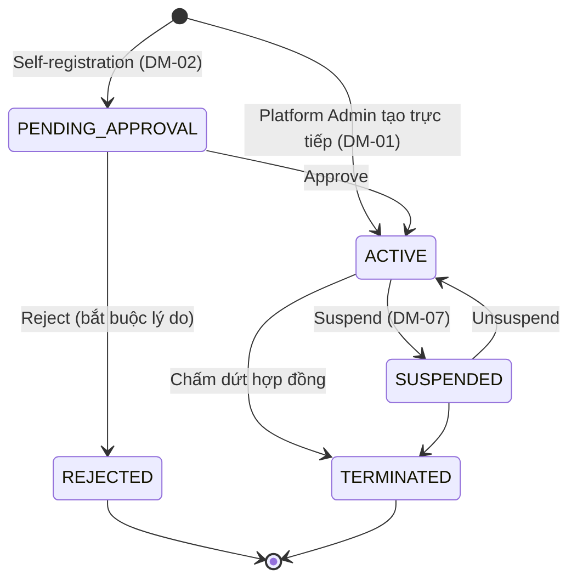
```mermaid
stateDiagram-v2
    [*] --> PENDING_APPROVAL: Self-registration (DM-02)
    [*] --> ACTIVE: Platform Admin tạo trực tiếp (DM-01)
    PENDING_APPROVAL --> ACTIVE: Approve
    PENDING_APPROVAL --> REJECTED: Reject (bắt buộc lý do)
    ACTIVE --> SUSPENDED: Suspend (DM-07)
    SUSPENDED --> ACTIVE: Unsuspend
    ACTIVE --> TERMINATED: Chấm dứt hợp đồng
    SUSPENDED --> TERMINATED
    REJECTED --> [*]
    TERMINATED --> [*]
```

**Hiệu ứng lan truyền khi `SUSPENDED`** (cần chốt policy — §7):
- Chặn: submit version mới, publish, tạo App mới, cấp credential mới.
- Tùy policy: `FREEZE` (App đang published vẫn chạy, chỉ khóa thao tác) hoặc `UNPUBLISH_ALL` (gỡ toàn bộ App khỏi phân phối).
- Ghi `partner_status_history` + audit.

### 3.2 Application

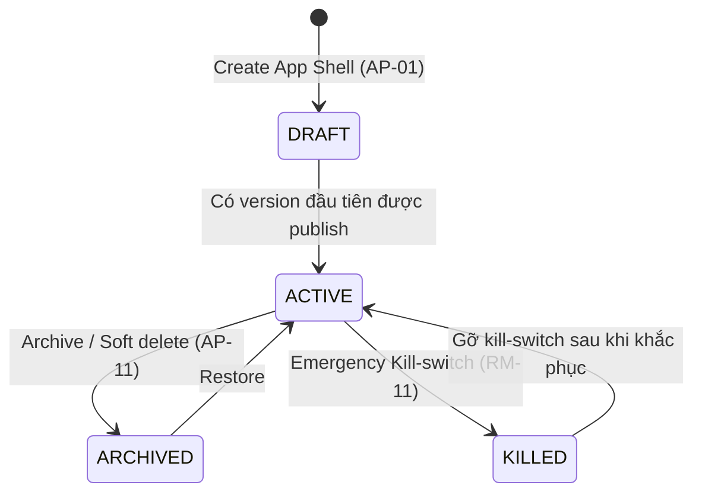
```mermaid
stateDiagram-v2
    [*] --> DRAFT: Create App Shell (AP-01)
    DRAFT --> ACTIVE: Có version đầu tiên được publish
    ACTIVE --> ARCHIVED: Archive / Soft delete (AP-11)
    ARCHIVED --> ACTIVE: Restore
    ACTIVE --> KILLED: Emergency Kill-switch (RM-11)
    KILLED --> ACTIVE: Gỡ kill-switch sau khi khắc phục
```

`KILLED` là cờ khẩn cấp ở cấp **Application**, không phải cấp version — vì RM-11 yêu cầu vô hiệu hóa cả bản đã cài trên thiết bị.

### 3.3 App Version — **luồng trung tâm**

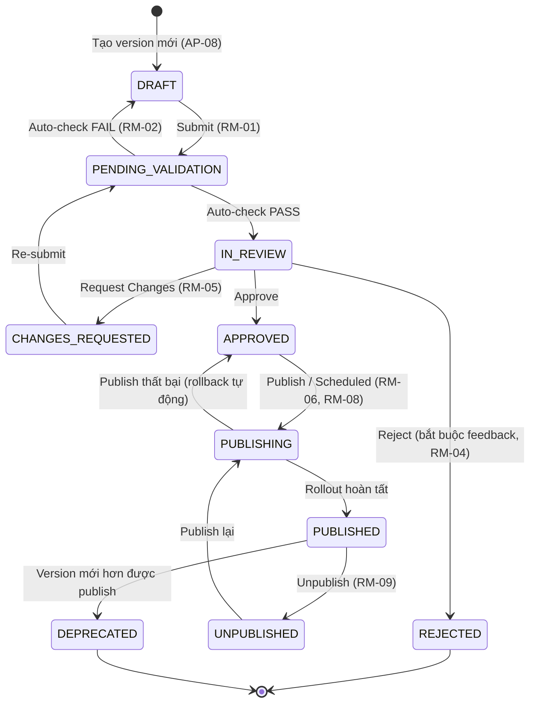
```mermaid
stateDiagram-v2
    [*] --> DRAFT: Tạo version mới (AP-08)
    DRAFT --> PENDING_VALIDATION: Submit (RM-01)
    PENDING_VALIDATION --> DRAFT: Auto-check FAIL (RM-02)
    PENDING_VALIDATION --> IN_REVIEW: Auto-check PASS
    IN_REVIEW --> CHANGES_REQUESTED: Request Changes (RM-05)
    CHANGES_REQUESTED --> PENDING_VALIDATION: Re-submit
    IN_REVIEW --> REJECTED: Reject (bắt buộc feedback, RM-04)
    IN_REVIEW --> APPROVED: Approve
    APPROVED --> PUBLISHING: Publish / Scheduled (RM-06, RM-08)
    PUBLISHING --> PUBLISHED: Rollout hoàn tất
    PUBLISHING --> APPROVED: Publish thất bại (rollback tự động)
    PUBLISHED --> UNPUBLISHED: Unpublish (RM-09)
    UNPUBLISHED --> PUBLISHING: Publish lại
    PUBLISHED --> DEPRECATED: Version mới hơn được publish
    REJECTED --> [*]
    DEPRECATED --> [*]
```

**Quy tắc trạng thái:**
- Chỉ `DRAFT` và `CHANGES_REQUESTED` cho phép chỉnh sửa metadata/artifact/permission/capability/intent.
- `REJECTED` là **terminal** — developer phải tạo version mới (giữ vết audit sạch). *Nếu PO muốn cho sửa lại thì đổi thành `REJECTED → CHANGES_REQUESTED`.*
- Điều kiện vào `APPROVED`: **mọi** `app_version_permissions` đã có quyết định, **mọi** Public Intent đã duyệt, **không còn** validation finding mức `ERROR`.
- Mỗi App chỉ có tối đa **1 version** ở trạng thái `PUBLISHED` trên mỗi channel (`PRODUCTION` / `SANDBOX`).

### 3.4 Permission Request (M3)

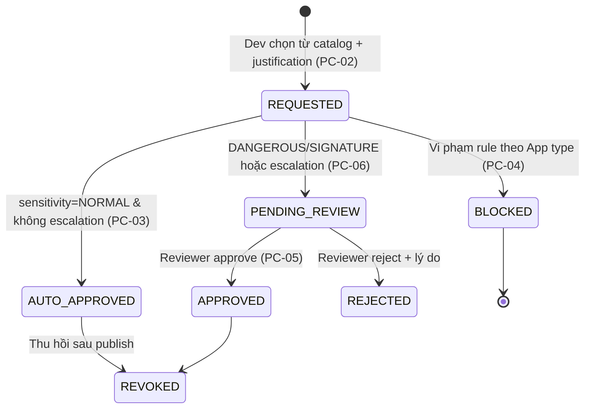
```mermaid
stateDiagram-v2
    [*] --> REQUESTED: Dev chọn từ catalog + justification (PC-02)
    REQUESTED --> BLOCKED: Vi phạm rule theo App type (PC-04)
    REQUESTED --> AUTO_APPROVED: sensitivity=NORMAL & không escalation (PC-03)
    REQUESTED --> PENDING_REVIEW: DANGEROUS/SIGNATURE hoặc escalation (PC-06)
    PENDING_REVIEW --> APPROVED: Reviewer approve (PC-05)
    PENDING_REVIEW --> REJECTED: Reviewer reject + lý do
    AUTO_APPROVED --> REVOKED: Thu hồi sau publish
    APPROVED --> REVOKED
    BLOCKED --> [*]
```

`BLOCKED` chặn submit — hiển thị lỗi ngay tại màn Permission (theo FL: "Hiển thị lỗi Permission").

### 3.5 App2App Intent / Purpose

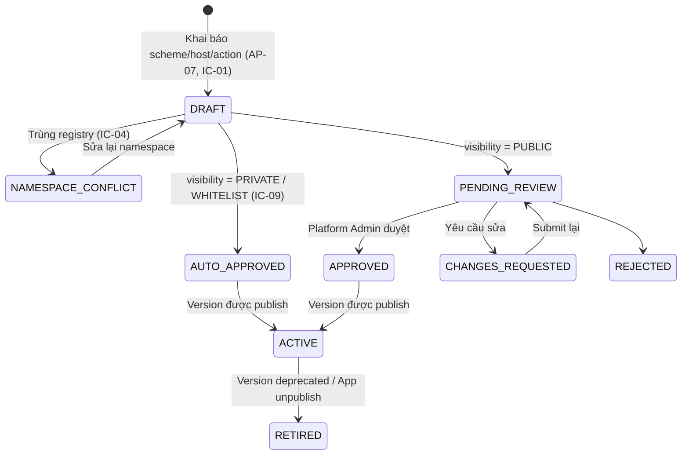
```mermaid
stateDiagram-v2
    [*] --> DRAFT: Khai báo scheme/host/action (AP-07, IC-01)
    DRAFT --> NAMESPACE_CONFLICT: Trùng registry (IC-04)
    NAMESPACE_CONFLICT --> DRAFT: Sửa lại namespace
    DRAFT --> AUTO_APPROVED: visibility = PRIVATE / WHITELIST (IC-09)
    DRAFT --> PENDING_REVIEW: visibility = PUBLIC
    PENDING_REVIEW --> APPROVED: Platform Admin duyệt
    PENDING_REVIEW --> CHANGES_REQUESTED: Yêu cầu sửa
    CHANGES_REQUESTED --> PENDING_REVIEW: Submit lại
    PENDING_REVIEW --> REJECTED
    AUTO_APPROVED --> ACTIVE: Version được publish
    APPROVED --> ACTIVE: Version được publish
    ACTIVE --> RETIRED: Version deprecated / App unpublish
```

**Cơ chế reservation namespace:** khi khai báo → tạo bản ghi `registry_entries` với `status = RESERVED` (khóa namespace cho app đó). Khi version publish → `ACTIVE`. Khi version bị reject/xóa → nhả `RELEASED`. Unique index chỉ áp dụng trên `RESERVED` + `ACTIVE`.

### 3.6 Release

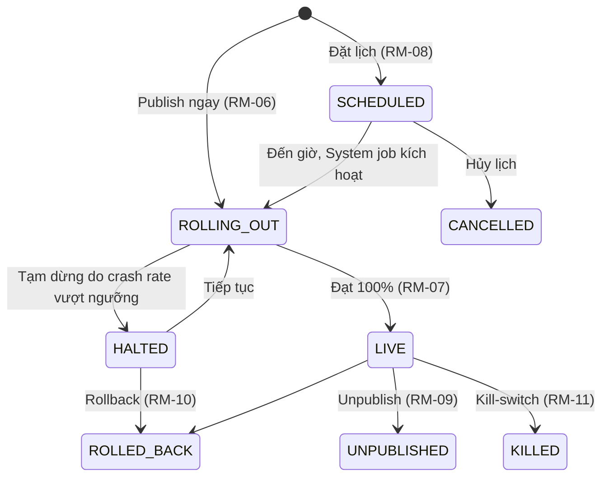
```mermaid
stateDiagram-v2
    [*] --> SCHEDULED: Đặt lịch (RM-08)
    [*] --> ROLLING_OUT: Publish ngay (RM-06)
    SCHEDULED --> ROLLING_OUT: Đến giờ, System job kích hoạt
    SCHEDULED --> CANCELLED: Hủy lịch
    ROLLING_OUT --> LIVE: Đạt 100% (RM-07)
    ROLLING_OUT --> HALTED: Tạm dừng do crash rate vượt ngưỡng
    HALTED --> ROLLING_OUT: Tiếp tục
    HALTED --> ROLLED_BACK: Rollback (RM-10)
    LIVE --> ROLLED_BACK
    LIVE --> UNPUBLISHED: Unpublish (RM-09)
    LIVE --> KILLED: Kill-switch (RM-11)
```

---

## 4. Luồng nghiệp vụ chi tiết

### F1 — Onboarding Partner (DM-01, DM-02, DM-03, DM-10)

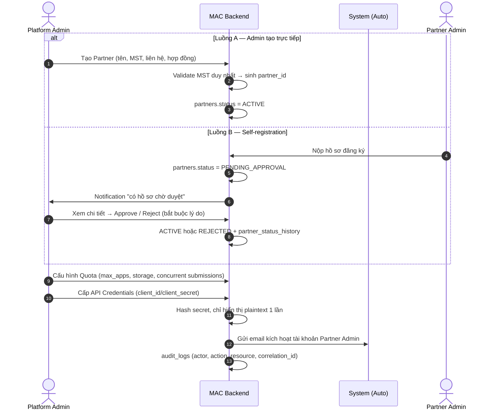
```mermaid
sequenceDiagram
    autonumber
    actor PA as Platform Admin
    participant MAC as MAC Backend
    participant SYS as System (Auto)
    actor PAD as Partner Admin

    alt Luồng A — Admin tạo trực tiếp
        PA->>MAC: Tạo Partner (tên, MST, liên hệ, hợp đồng)
        MAC->>MAC: Validate MST duy nhất → sinh partner_id
        MAC->>MAC: partners.status = ACTIVE
    else Luồng B — Self-registration
        PAD->>MAC: Nộp hồ sơ đăng ký
        MAC->>MAC: partners.status = PENDING_APPROVAL
        MAC->>PA: Notification "có hồ sơ chờ duyệt"
        PA->>MAC: Xem chi tiết → Approve / Reject (bắt buộc lý do)
        MAC->>MAC: ACTIVE hoặc REJECTED + partner_status_history
    end

    PA->>MAC: Cấu hình Quota (max_apps, storage, concurrent submissions)
    PA->>MAC: Cấp API Credentials (client_id/client_secret)
    MAC->>MAC: Hash secret, chỉ hiển thị plaintext 1 lần
    MAC->>SYS: Gửi email kích hoạt tài khoản Partner Admin
    MAC->>MAC: audit_logs (actor, action, resource, correlation_id)
```

**Điểm cần lưu ý khi implement:**
- `client_secret` chỉ lưu hash (bcrypt/argon2), plaintext hiển thị đúng một lần lúc tạo.
- Thu hồi credential = set `revoked_at`, không xóa cứng — giữ vết cho audit.
- Quota kiểm tra tại thời điểm hành động, không phải batch job (tránh vượt hạn tạm thời).

### F2 — Tạo Developer & phân App (DM-04, DM-05)

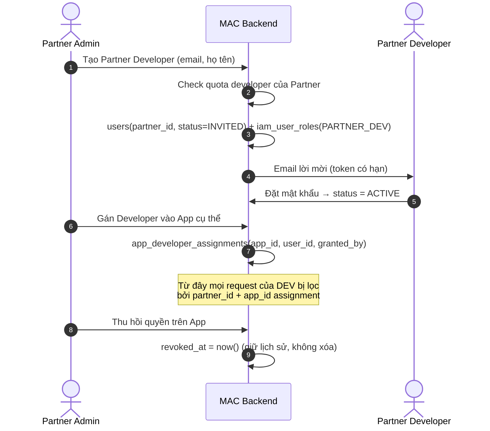
```mermaid
sequenceDiagram
    autonumber
    actor PAD as Partner Admin
    participant MAC as MAC Backend
    actor DEV as Partner Developer

    PAD->>MAC: Tạo Partner Developer (email, họ tên)
    MAC->>MAC: Check quota developer của Partner
    MAC->>MAC: users(partner_id, status=INVITED) + iam_user_roles(PARTNER_DEV)
    MAC->>DEV: Email lời mời (token có hạn)
    DEV->>MAC: Đặt mật khẩu → status = ACTIVE

    PAD->>MAC: Gán Developer vào App cụ thể
    MAC->>MAC: app_developer_assignments(app_id, user_id, granted_by)
    Note over MAC: Từ đây mọi request của DEV bị lọc<br/>bởi partner_id + app_id assignment
    PAD->>MAC: Thu hồi quyền trên App
    MAC->>MAC: revoked_at = now() (giữ lịch sử, không xóa)
```

### F3 — Tạo App & Version theo type (AP-01 → AP-08)

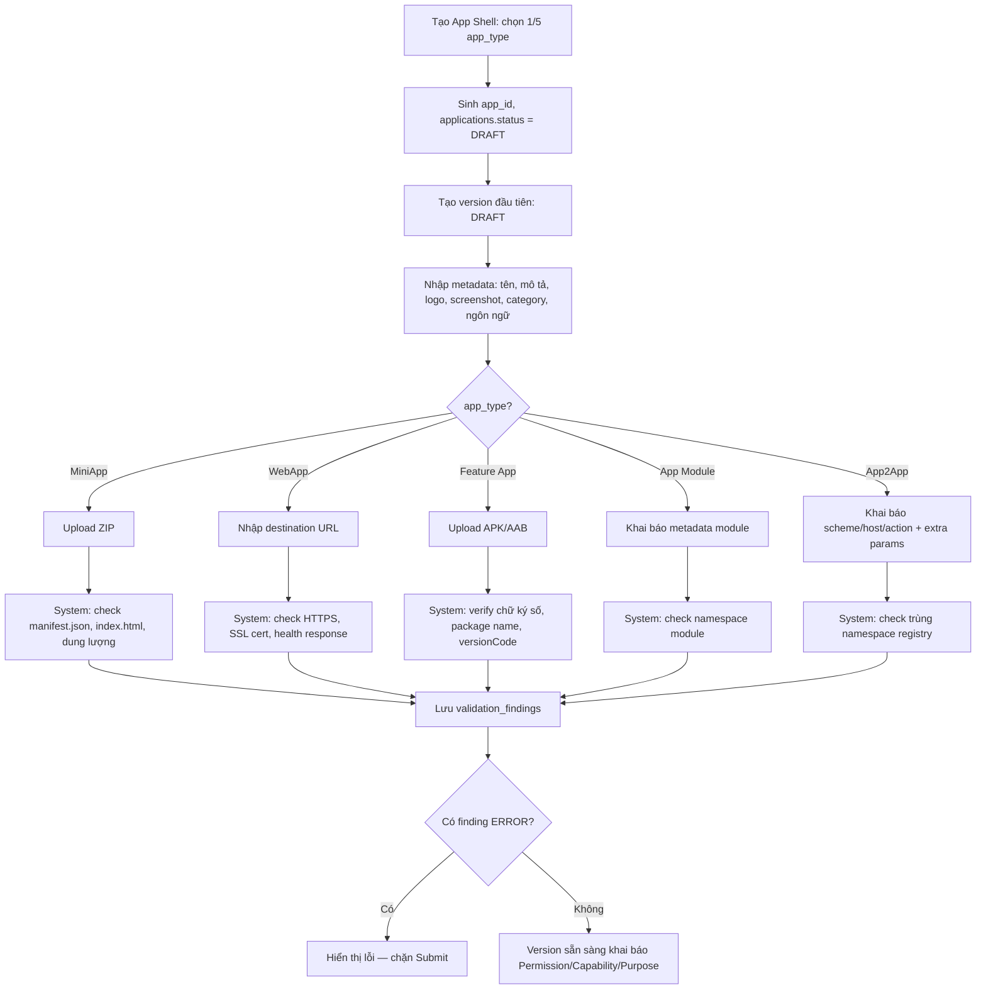
```mermaid
flowchart TD
    A[Tạo App Shell: chọn 1/5 app_type] --> B[Sinh app_id, applications.status = DRAFT]
    B --> C[Tạo version đầu tiên: DRAFT]
    C --> D[Nhập metadata: tên, mô tả, logo, screenshot, category, ngôn ngữ]
    D --> E{app_type?}

    E -->|MiniApp| F1[Upload ZIP]
    F1 --> G1[System: check manifest.json, index.html, dung lượng]

    E -->|WebApp| F2[Nhập destination URL]
    F2 --> G2[System: check HTTPS, SSL cert, health response]

    E -->|Feature App| F3[Upload APK/AAB]
    F3 --> G3[System: verify chữ ký số, package name, versionCode]

    E -->|App Module| F4[Khai báo metadata module]
    F4 --> G4[System: check namespace module]

    E -->|App2App| F5[Khai báo scheme/host/action + extra params]
    F5 --> G5[System: check trùng namespace registry]

    G1 & G2 & G3 & G4 & G5 --> H[Lưu validation_findings]
    H --> I{Có finding ERROR?}
    I -->|Có| J[Hiển thị lỗi — chặn Submit]
    I -->|Không| K[Version sẵn sàng khai báo Permission/Capability/Purpose]
```

**Ràng buộc quan trọng:** `version_code` phải **tăng đơn điệu** trong cùng một App (unique + check > max hiện tại). Đây là điều kiện tiên quyết để rollback và diff hoạt động đúng.

### F4 — Khai báo & duyệt Permission (PC-02 → PC-06)

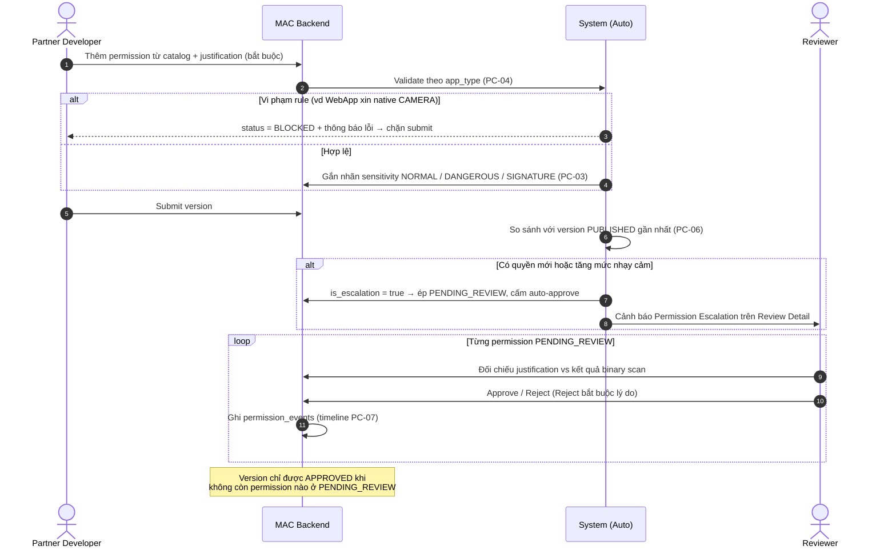
```mermaid
sequenceDiagram
    autonumber
    actor DEV as Partner Developer
    participant MAC as MAC Backend
    participant SYS as System (Auto)
    actor REV as Reviewer

    DEV->>MAC: Thêm permission từ catalog + justification (bắt buộc)
    MAC->>SYS: Validate theo app_type (PC-04)
    alt Vi phạm rule (vd WebApp xin native CAMERA)
        SYS-->>DEV: status = BLOCKED + thông báo lỗi → chặn submit
    else Hợp lệ
        SYS->>MAC: Gắn nhãn sensitivity NORMAL / DANGEROUS / SIGNATURE (PC-03)
    end

    DEV->>MAC: Submit version
    SYS->>SYS: So sánh với version PUBLISHED gần nhất (PC-06)
    alt Có quyền mới hoặc tăng mức nhạy cảm
        SYS->>MAC: is_escalation = true → ép PENDING_REVIEW, cấm auto-approve
        SYS->>REV: Cảnh báo Permission Escalation trên Review Detail
    end

    loop Từng permission PENDING_REVIEW
        REV->>MAC: Đối chiếu justification vs kết quả binary scan
        REV->>MAC: Approve / Reject (Reject bắt buộc lý do)
        MAC->>MAC: Ghi permission_events (timeline PC-07)
    end

    Note over MAC: Version chỉ được APPROVED khi<br/>không còn permission nào ở PENDING_REVIEW
```

**Thuật toán phát hiện escalation (PC-06):**
```
base = version PUBLISHED gần nhất của app (nếu chưa có → mọi permission đều là mới)
for p in permissions(version_mới):
    if p ∉ base                              → escalation (quyền mới)
    elif sensitivity(p) > sensitivity_base(p) → escalation (tăng mức nhạy cảm)
    elif scope(p) mở rộng hơn base            → escalation
→ nếu có bất kỳ escalation nào: bắt buộc manual review toàn version
```

### F5 — Purpose / Intent / Datasource (IC-01 → IC-09)

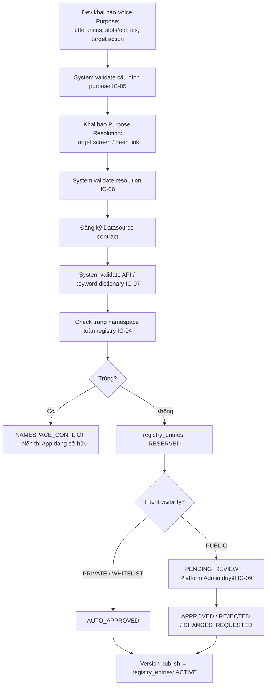
```mermaid
flowchart TD
    A[Dev khai báo Voice Purpose:<br/>utterances, slots/entities, target action] --> B[System validate cấu hình purpose IC-05]
    B --> C[Khai báo Purpose Resolution:<br/>target screen / deep link]
    C --> D[System validate resolution IC-06]
    D --> E[Đăng ký Datasource contract]
    E --> F[System validate API / keyword dictionary IC-07]
    F --> G[Check trùng namespace toàn registry IC-04]
    G --> H{Trùng?}
    H -->|Có| I[NAMESPACE_CONFLICT — hiển thị App đang sở hữu]
    H -->|Không| J[registry_entries: RESERVED]
    J --> K{Intent visibility?}
    K -->|PRIVATE / WHITELIST| L[AUTO_APPROVED]
    K -->|PUBLIC| M[PENDING_REVIEW → Platform Admin duyệt IC-09]
    M --> N[APPROVED / REJECTED / CHANGES_REQUESTED]
    L & N --> O[Version publish → registry_entries: ACTIVE]
```

**Whitelist (IC-08):** khi `visibility = WHITELIST`, mỗi `app_id` được phép gọi lưu ở `intent_whitelist_entries`. Runtime check: caller app phải nằm trong whitelist **và** intent phải ở trạng thái `ACTIVE`.

### F6 — Submit & Auto-check (RM-01, RM-02)

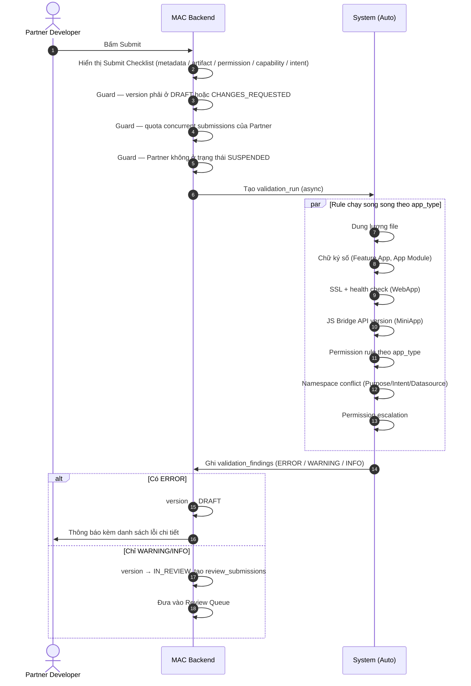
```mermaid
sequenceDiagram
    autonumber
    actor DEV as Partner Developer
    participant MAC as MAC Backend
    participant SYS as System (Auto)

    DEV->>MAC: Bấm Submit
    MAC->>MAC: Hiển thị Submit Checklist (metadata / artifact / permission / capability / intent)
    MAC->>MAC: Guard — version phải ở DRAFT hoặc CHANGES_REQUESTED
    MAC->>MAC: Guard — quota concurrent submissions của Partner
    MAC->>MAC: Guard — Partner không ở trạng thái SUSPENDED
    MAC->>SYS: Tạo validation_run (async)

    par Rule chạy song song theo app_type
        SYS->>SYS: Dung lượng file
        SYS->>SYS: Chữ ký số (Feature App, App Module)
        SYS->>SYS: SSL + health check (WebApp)
        SYS->>SYS: JS Bridge API version (MiniApp)
        SYS->>SYS: Permission rule theo app_type
        SYS->>SYS: Namespace conflict (Purpose/Intent/Datasource)
        SYS->>SYS: Permission escalation
    end

    SYS->>MAC: Ghi validation_findings (ERROR / WARNING / INFO)
    alt Có ERROR
        MAC->>MAC: version → DRAFT
        MAC->>DEV: Thông báo kèm danh sách lỗi chi tiết
    else Chỉ WARNING/INFO
        MAC->>MAC: version → IN_REVIEW, tạo review_submissions
        MAC->>MAC: Đưa vào Review Queue
    end
```

### F7 — Review (RM-03, RM-04, RM-05)

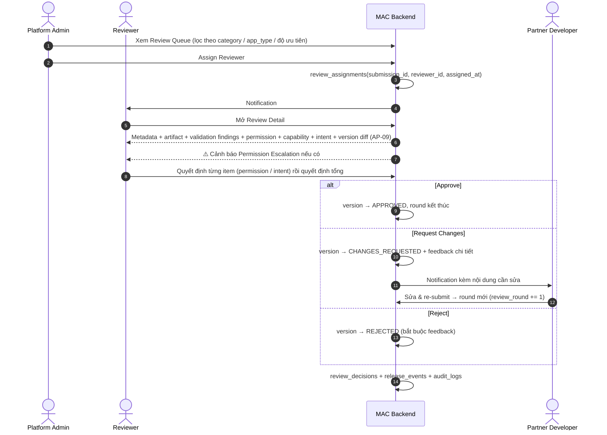
```mermaid
sequenceDiagram
    autonumber
    actor PA as Platform Admin
    actor REV as Reviewer
    participant MAC as MAC Backend
    actor DEV as Partner Developer

    PA->>MAC: Xem Review Queue (lọc theo category / app_type / độ ưu tiên)
    PA->>MAC: Assign Reviewer
    MAC->>MAC: review_assignments(submission_id, reviewer_id, assigned_at)
    MAC->>REV: Notification

    REV->>MAC: Mở Review Detail
    MAC-->>REV: Metadata + artifact + validation findings + permission + capability + intent + version diff (AP-09)
    MAC-->>REV: ⚠️ Cảnh báo Permission Escalation nếu có

    REV->>MAC: Quyết định từng item (permission / intent) rồi quyết định tổng
    alt Approve
        MAC->>MAC: version → APPROVED, round kết thúc
    else Request Changes
        MAC->>MAC: version → CHANGES_REQUESTED + feedback chi tiết
        MAC->>DEV: Notification kèm nội dung cần sửa
        DEV->>MAC: Sửa & re-submit → round mới (review_round += 1)
    else Reject
        MAC->>MAC: version → REJECTED (bắt buộc feedback)
    end
    MAC->>MAC: review_decisions + release_events + audit_logs
```

**Nhiều vòng review:** `review_submissions` giữ 1 bản ghi cho mỗi lần submit; `review_round` tăng dần để tra được lịch sử các vòng (theo yêu cầu "Theo dõi lịch sử các vòng review" ở sheet Role).

### F8 — Publish & Rollout (RM-06, RM-07, RM-08)

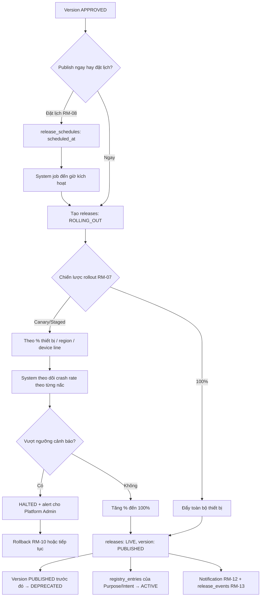
```mermaid
flowchart TD
    A[Version APPROVED] --> B{Publish ngay hay đặt lịch?}
    B -->|Đặt lịch RM-08| C[release_schedules: scheduled_at]
    C --> D[System job đến giờ kích hoạt]
    B -->|Ngay| E[Tạo releases: ROLLING_OUT]
    D --> E
    E --> F{Chiến lược rollout RM-07}
    F -->|100%| G[Đẩy toàn bộ thiết bị]
    F -->|Canary/Staged| H[Theo % thiết bị / region / device line]
    H --> I[System theo dõi crash rate theo từng nấc]
    I --> J{Vượt ngưỡng cảnh báo?}
    J -->|Có| K[HALTED + alert cho Platform Admin]
    K --> L[Rollback RM-10 hoặc tiếp tục]
    J -->|Không| M[Tăng % đến 100%]
    G & M --> N[releases: LIVE, version: PUBLISHED]
    N --> O[Version PUBLISHED trước đó → DEPRECATED]
    N --> P[registry_entries của Purpose/Intent → ACTIVE]
    N --> Q[Notification RM-12 + release_events RM-13]
```

**Bất biến cần enforce:** tại mỗi thời điểm, mỗi `(app_id, channel)` chỉ có **một** release ở trạng thái `LIVE`. Dùng partial unique index (xem §5.5).

### F9 — Sự cố: Unpublish / Rollback / Kill-switch (RM-09, RM-10, RM-11)

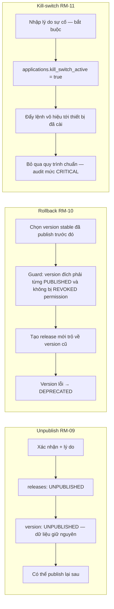
```mermaid
flowchart LR
    subgraph Unpublish["Unpublish RM-09"]
        A1[Xác nhận + lý do] --> A2[releases: UNPUBLISHED]
        A2 --> A3[version: UNPUBLISHED — dữ liệu giữ nguyên]
        A3 --> A4[Có thể publish lại sau]
    end
    subgraph Rollback["Rollback RM-10"]
        B1[Chọn version stable đã publish trước đó] --> B2[Guard: version đích phải từng PUBLISHED và không bị REVOKED permission]
        B2 --> B3[Tạo release mới trỏ về version cũ]
        B3 --> B4[Version lỗi → DEPRECATED]
    end
    subgraph Kill["Kill-switch RM-11"]
        C1[Nhập lý do sự cố — bắt buộc] --> C2[applications.kill_switch_active = true]
        C2 --> C3[Đẩy lệnh vô hiệu tới thiết bị đã cài]
        C3 --> C4[Bỏ qua quy trình chuẩn — audit mức CRITICAL]
    end
```

Kill-switch là hành động phá vỡ quy trình → bắt buộc: lý do, xác nhận 2 bước, audit `severity = CRITICAL`, và cảnh báo tới toàn bộ Platform Admin.

### F10 — Suspend Partner (DM-07)

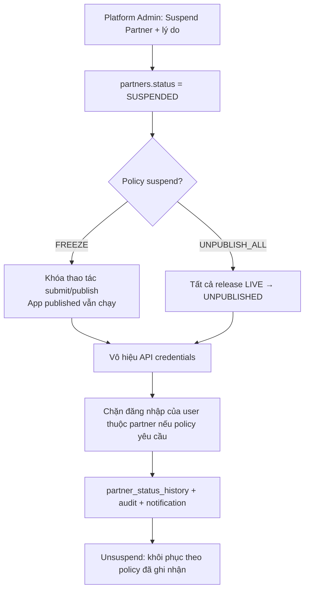
```mermaid
flowchart TD
    A[Platform Admin: Suspend Partner + lý do] --> B[partners.status = SUSPENDED]
    B --> C{Policy suspend?}
    C -->|FREEZE| D[Khóa thao tác submit/publish<br/>App published vẫn chạy]
    C -->|UNPUBLISH_ALL| E[Tất cả release LIVE → UNPUBLISHED]
    D & E --> F[Vô hiệu API credentials]
    F --> G[Chặn đăng nhập của user thuộc partner nếu policy yêu cầu]
    G --> H[partner_status_history + audit + notification]
    H --> I[Unsuspend: khôi phục theo policy đã ghi nhận]
```

### F11 — Thống kê & cảnh báo (DS-01 → DS-06)

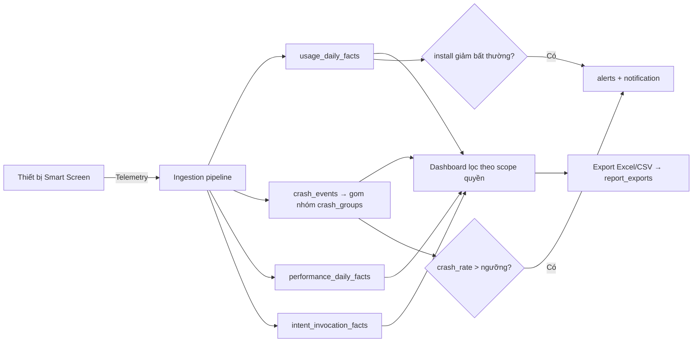
```mermaid
flowchart LR
    A[Thiết bị Smart Screen] -->|Telemetry| B[Ingestion pipeline]
    B --> C[usage_daily_facts]
    B --> D[crash_events → gom nhóm crash_groups]
    B --> E[performance_daily_facts]
    B --> F[intent_invocation_facts]
    C & D & E & F --> G[Dashboard lọc theo scope quyền]
    D --> H{crash_rate > ngưỡng?}
    C --> I{install giảm bất thường?}
    H & I -->|Có| J[alerts + notification]
    G --> K[Export Excel/CSV → report_exports]
```

**Lưu ý về scope dữ liệu thống kê:** Partner Dev chỉ thấy App được assign; Partner Admin thấy toàn bộ App của partner; Platform Admin thấy toàn hệ thống. Áp cùng một `data_scope` filter như phần CRUD, không viết riêng logic cho dashboard.

---

## 5. Database Schema

### 5.1 Quy ước chung

| Hạng mục | Quy ước |
|---|---|
| Khóa chính | `UUID` (`gen_random_uuid()`) — tránh lộ thứ tự, thuận tiện khi phân mảnh |
| Mã nghiệp vụ | Cột riêng `code` dạng human-readable (`partner_code`, `app_code`) cho hiển thị |
| Audit cột | `created_at`, `created_by`, `updated_at`, `updated_by` trên mọi bảng nghiệp vụ |
| Soft delete | `deleted_at NULL` — dùng cho Archive (AP-11), không xóa cứng dữ liệu có lịch sử |
| Tenant | `partner_id` trên mọi bảng thuộc phạm vi partner → bật RLS |
| Thời gian | `TIMESTAMPTZ`, lưu UTC |
| Enum | Native `ENUM` type để tự tài liệu hóa; nếu ưu tiên dễ migration thì đổi sang `TEXT + CHECK` |
| JSON | `JSONB` cho cấu hình linh hoạt (extra params, rollout config, diff payload) |

### 5.2 ERD — Domain A: IAM & Tenant (M1)

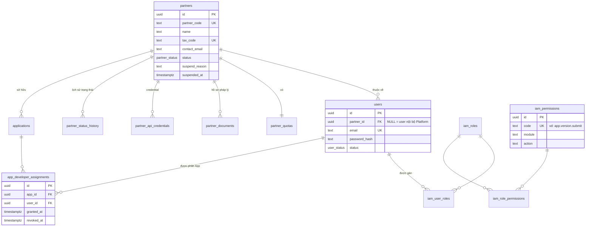
```mermaid
erDiagram
    partners ||--o{ users : "thuộc về"
    partners ||--|| partner_quotas : "có"
    partners ||--o{ partner_documents : "hồ sơ pháp lý"
    partners ||--o{ partner_api_credentials : "credential"
    partners ||--o{ partner_status_history : "lịch sử trạng thái"
    partners ||--o{ applications : "sở hữu"
    users ||--o{ iam_user_roles : "được gán"
    iam_roles ||--o{ iam_user_roles : ""
    iam_roles ||--o{ iam_role_permissions : ""
    iam_permissions ||--o{ iam_role_permissions : ""
    users ||--o{ app_developer_assignments : "được phân App"
    applications ||--o{ app_developer_assignments : ""

    partners {
        uuid id PK
        text partner_code UK
        text name
        text tax_code UK
        text contact_email
        partner_status status
        text suspend_reason
        timestamptz suspended_at
    }
    users {
        uuid id PK
        uuid partner_id FK "NULL = user nội bộ Platform"
        text email UK
        text password_hash
        user_status status
    }
    iam_permissions {
        uuid id PK
        text code UK "vd: app.version.submit"
        text module
        text action
    }
    app_developer_assignments {
        uuid id PK
        uuid app_id FK
        uuid user_id FK
        timestamptz granted_at
        timestamptz revoked_at
    }
```

### 5.3 ERD — Domain B: Application & Version (M2)

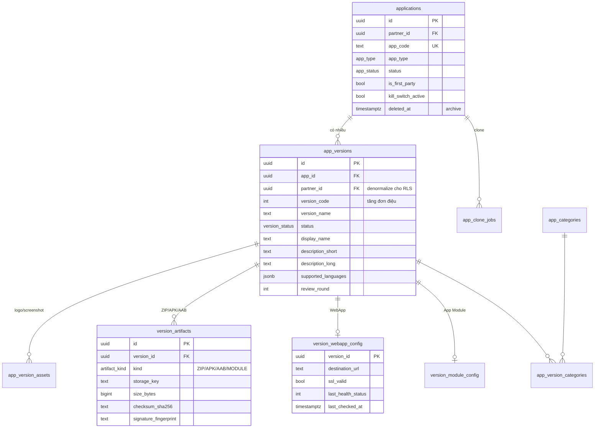
```mermaid
erDiagram
    applications ||--o{ app_versions : "có nhiều"
    app_versions ||--o{ app_version_assets : "logo/screenshot"
    app_versions ||--o{ version_artifacts : "ZIP/APK/AAB"
    app_versions ||--o| version_webapp_config : "WebApp"
    app_versions ||--o| version_module_config : "App Module"
    applications ||--o{ app_clone_jobs : "clone"
    app_categories ||--o{ app_version_categories : ""
    app_versions ||--o{ app_version_categories : ""

    applications {
        uuid id PK
        uuid partner_id FK
        text app_code UK
        app_type app_type
        app_status status
        bool is_first_party
        bool kill_switch_active
        timestamptz deleted_at "archive"
    }
    app_versions {
        uuid id PK
        uuid app_id FK
        uuid partner_id FK "denormalize cho RLS"
        int version_code "tăng đơn điệu"
        text version_name
        version_status status
        text display_name
        text description_short
        text description_long
        jsonb supported_languages
        int review_round
    }
    version_artifacts {
        uuid id PK
        uuid version_id FK
        artifact_kind kind "ZIP/APK/AAB/MODULE"
        text storage_key
        bigint size_bytes
        text checksum_sha256
        text signature_fingerprint
    }
    version_webapp_config {
        uuid version_id PK
        text destination_url
        bool ssl_valid
        int last_health_status
        timestamptz last_checked_at
    }
```

### 5.4 ERD — Domain C+D: Permission & Capability (M3, M4)

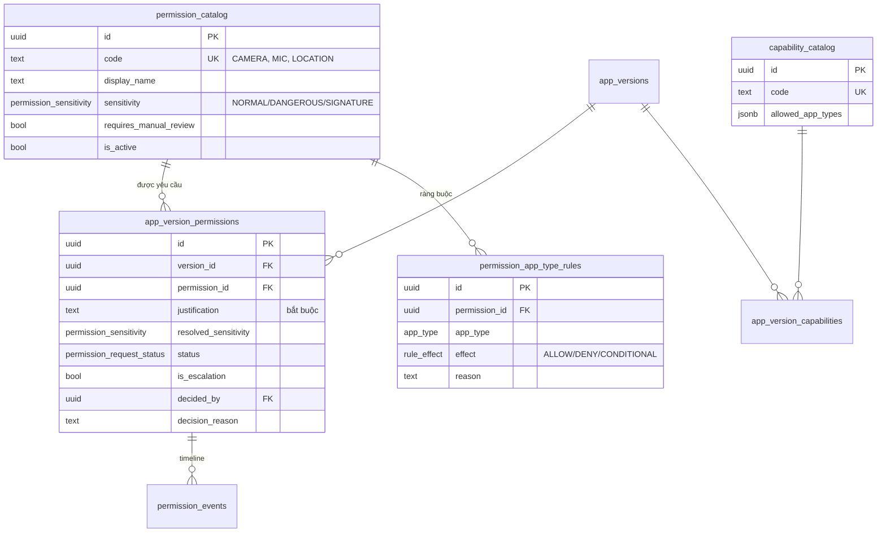
```mermaid
erDiagram
    permission_catalog ||--o{ app_version_permissions : "được yêu cầu"
    permission_catalog ||--o{ permission_app_type_rules : "ràng buộc"
    app_versions ||--o{ app_version_permissions : ""
    app_version_permissions ||--o{ permission_events : "timeline"
    capability_catalog ||--o{ app_version_capabilities : ""
    app_versions ||--o{ app_version_capabilities : ""

    permission_catalog {
        uuid id PK
        text code UK "CAMERA, MIC, LOCATION"
        text display_name
        permission_sensitivity sensitivity "NORMAL/DANGEROUS/SIGNATURE"
        bool requires_manual_review
        bool is_active
    }
    permission_app_type_rules {
        uuid id PK
        uuid permission_id FK
        app_type app_type
        rule_effect effect "ALLOW/DENY/CONDITIONAL"
        text reason
    }
    app_version_permissions {
        uuid id PK
        uuid version_id FK
        uuid permission_id FK
        text justification "bắt buộc"
        permission_sensitivity resolved_sensitivity
        permission_request_status status
        bool is_escalation
        uuid decided_by FK
        text decision_reason
    }
    capability_catalog {
        uuid id PK
        text code UK
        jsonb allowed_app_types
    }
```

### 5.5 ERD — Domain E: Purpose / Intent / Registry (M5)

```mermaid
erDiagram
    app_versions ||--o{ voice_purposes : ""
    voice_purposes ||--o{ purpose_utterances : "training phrases"
    voice_purposes ||--o{ purpose_slots : "slots/entities"
    app_versions ||--o{ purpose_resolutions : ""
    purpose_resolutions ||--o{ purpose_resolution_targets : ""
    app_versions ||--o{ app2app_intents : ""
    app2app_intents ||--o{ intent_params : "extra params"
    app2app_intents ||--o{ intent_whitelist_entries : "whitelist app_id"
    app_versions ||--o{ datasources : ""
    registry_entries }o--|| applications : "owner"

    voice_purposes {
        uuid id PK
        uuid version_id FK
        text purpose_key "namespace toàn cục"
        text target_action
        purpose_status status
    }
    app2app_intents {
        uuid id PK
        uuid version_id FK
        text scheme
        text host
        text action
        intent_visibility visibility "PUBLIC/PRIVATE/WHITELIST"
        intent_status status
    }
    registry_entries {
        uuid id PK
        registry_entry_type entry_type "PURPOSE/INTENT/DATASOURCE/SCHEME"
        text namespace_key
        uuid owner_app_id FK
        uuid owner_version_id FK
        registry_status status "RESERVED/ACTIVE/RELEASED"
    }
    datasources {
        uuid id PK
        uuid version_id FK
        text datasource_key
        datasource_kind kind "API/DICTIONARY"
        jsonb contract_spec
        text endpoint_url
    }
```

### 5.6 ERD — Domain F: Review & Release (M6)

```mermaid
erDiagram
    app_versions ||--o{ validation_runs : ""
    validation_runs ||--o{ validation_findings : ""
    app_versions ||--o{ review_submissions : ""
    review_submissions ||--o{ review_assignments : ""
    review_submissions ||--o{ review_decisions : ""
    review_decisions ||--o{ review_item_decisions : "per permission/intent"
    app_versions ||--o{ releases : ""
    releases ||--o| release_rollouts : ""
    releases ||--o| release_schedules : ""
    applications ||--o{ release_events : "timeline"

    validation_findings {
        uuid id PK
        uuid run_id FK
        text rule_code
        finding_severity severity "ERROR/WARNING/INFO"
        text message
        jsonb context
    }
    review_submissions {
        uuid id PK
        uuid version_id FK
        uuid partner_id FK
        int review_round
        submission_status status
        uuid submitted_by FK
        timestamptz submitted_at
    }
    review_decisions {
        uuid id PK
        uuid submission_id FK
        review_decision_type decision "APPROVE/REJECT/REQUEST_CHANGES"
        text feedback "bắt buộc khi REJECT"
        uuid decided_by FK
    }
    releases {
        uuid id PK
        uuid app_id FK
        uuid version_id FK
        release_channel channel "PRODUCTION/SANDBOX"
        release_status status
        timestamptz published_at
        uuid published_by FK
    }
    release_rollouts {
        uuid release_id PK
        int percentage
        jsonb target_regions
        jsonb target_device_lines
    }
```

### 5.7 ERD — Domain G+H: Analytics & Cross-cutting (M7)

```mermaid
erDiagram
    applications ||--o{ usage_daily_facts : ""
    applications ||--o{ crash_groups : ""
    crash_groups ||--o{ crash_events : ""
    applications ||--o{ performance_daily_facts : ""
    app2app_intents ||--o{ intent_invocation_facts : ""
    alert_rules ||--o{ alerts : ""
    users ||--o{ notifications : "người nhận"

    usage_daily_facts {
        uuid id PK
        uuid app_id FK
        uuid partner_id FK
        date stat_date
        text device_line
        text region
        int install_count
        int activation_count
        int dau
        int mau
    }
    crash_groups {
        uuid id PK
        uuid app_id FK
        uuid version_id FK
        text fingerprint UK
        text error_type
        int occurrence_count
        int affected_device_count
    }
    audit_logs {
        uuid id PK
        uuid actor_user_id FK "NULL nếu System"
        text actor_type "USER/SYSTEM"
        uuid partner_id FK
        text action
        text resource_type
        uuid resource_id
        jsonb before_state
        jsonb after_state
        uuid correlation_id
        audit_severity severity
    }
```

### 5.8 Ràng buộc & Index then chốt

| Mục đích | Ràng buộc |
|---|---|
| Version code tăng đơn điệu | `UNIQUE (app_id, version_code)` + trigger kiểm tra `> MAX(version_code)` hiện tại |
| 1 release LIVE / app / channel | `CREATE UNIQUE INDEX ... ON releases(app_id, channel) WHERE status = 'LIVE'` |
| 1 version PUBLISHED / app | `CREATE UNIQUE INDEX ... ON app_versions(app_id) WHERE status = 'PUBLISHED'` |
| Namespace registry không trùng | `CREATE UNIQUE INDEX ... ON registry_entries(entry_type, namespace_key) WHERE status IN ('RESERVED','ACTIVE')` |
| Assignment không trùng | `CREATE UNIQUE INDEX ... ON app_developer_assignments(app_id, user_id) WHERE revoked_at IS NULL` |
| Permission không khai trùng trong version | `UNIQUE (version_id, permission_id)` |
| Justification bắt buộc | `CHECK (length(trim(justification)) >= 20)` |
| Feedback bắt buộc khi Reject | `CHECK (decision <> 'REJECT' OR length(trim(feedback)) > 0)` |
| Rollout hợp lệ | `CHECK (percentage BETWEEN 1 AND 100)` |
| Truy vấn dashboard | Index `(partner_id, app_id, stat_date)` trên các bảng fact |
| Audit tra cứu | Index `(partner_id, created_at DESC)`, `(resource_type, resource_id)`, `(correlation_id)` |

### 5.9 Row-Level Security (tenant isolation)

```sql
ALTER TABLE applications ENABLE ROW LEVEL SECURITY;

CREATE POLICY app_tenant_isolation ON applications
USING (
    current_setting('app.role_code') = 'PLATFORM_ADMIN'
    OR partner_id = current_setting('app.partner_id')::uuid
);

CREATE POLICY app_developer_scope ON applications
USING (
    current_setting('app.role_code') <> 'PARTNER_DEV'
    OR id IN (
        SELECT app_id FROM app_developer_assignments
        WHERE user_id = current_setting('app.user_id')::uuid
          AND revoked_at IS NULL
    )
);
```

Áp cùng mẫu cho `app_versions`, `app_version_permissions`, `releases`, và toàn bộ bảng fact.

---

## 6. Mapping FR → bảng chính

| FR | Chức năng | Bảng liên quan |
|---|---|---|
| DM-01, DM-02 | Khởi tạo / duyệt Partner | `partners`, `partner_status_history` |
| DM-03 | API Credentials | `partner_api_credentials` |
| DM-04 | Tạo Partner Dev | `users`, `iam_user_roles` |
| DM-05 | Phân quyền RBAC theo App | `app_developer_assignments` |
| DM-06 | Role & Permission Matrix | `iam_roles`, `iam_permissions`, `iam_role_permissions` |
| DM-07 | Suspend Partner | `partners.status`, `partner_status_history` |
| DM-08 | Audit Log | `audit_logs` |
| DM-09 | Hồ sơ pháp lý | `partner_documents` |
| DM-10 | Quota | `partner_quotas` |
| AP-01, AP-08 | App + Version | `applications`, `app_versions` |
| AP-02 | Metadata | `app_versions`, `app_version_assets`, `app_version_categories` |
| AP-03, AP-05, AP-06 | Artifact | `version_artifacts`, `version_module_config` |
| AP-04 | WebApp URL | `version_webapp_config` |
| AP-07 | App2App protocol | `app2app_intents`, `intent_params` |
| AP-09 | Version diff | Tính từ `app_versions` + `app_version_permissions` (cache tùy chọn) |
| AP-10 | Clone | `app_clone_jobs` |
| AP-11 | Archive | `applications.deleted_at` |
| AP-12 | Preview/Test | `preview_sessions` (QR token có hạn) |
| PC-01 | Permission catalog | `permission_catalog` |
| PC-02, PC-05 | Request & duyệt | `app_version_permissions` |
| PC-03 | Phân loại nhạy cảm | `permission_catalog.sensitivity` |
| PC-04 | Giới hạn theo App type | `permission_app_type_rules` |
| PC-06 | Escalation | `app_version_permissions.is_escalation` |
| PC-07 | Lịch sử Permission | `permission_events` |
| CC-01 | Capability | `capability_catalog`, `app_version_capabilities` |
| IC-01, IC-02 | Voice Purpose & Resolution | `voice_purposes`, `purpose_utterances`, `purpose_slots`, `purpose_resolutions` |
| IC-03 | Datasource | `datasources` |
| IC-04 | Registry toàn cục | `registry_entries` |
| IC-05→07 | Validate | `validation_runs`, `validation_findings` |
| IC-08 | Access control Intent | `app2app_intents.visibility`, `intent_whitelist_entries` |
| IC-09 | Duyệt Public Intent | `review_item_decisions` |
| RM-01, RM-02 | Submit & auto-check | `review_submissions`, `validation_runs` |
| RM-03 | Queue & assign | `review_assignments` |
| RM-04, RM-05 | Approve/Reject/Changes | `review_decisions` |
| RM-06, RM-09 | Publish / Unpublish | `releases` |
| RM-07 | Rollout | `release_rollouts` |
| RM-08 | Scheduled | `release_schedules` |
| RM-10 | Rollback | `releases` (bản ghi mới trỏ version cũ) |
| RM-11 | Kill-switch | `applications.kill_switch_active`, `kill_switch_actions` |
| RM-12 | Notification | `notifications` |
| RM-13 | Release timeline | `release_events` |
| DS-01 | Install/DAU/MAU | `usage_daily_facts` |
| DS-02 | Crash | `crash_groups`, `crash_events` |
| DS-03 | Performance | `performance_daily_facts` |
| DS-04 | Intent invocation | `intent_invocation_facts` |
| DS-05 | Platform dashboard | Aggregate view |
| DS-06 | Export | `report_exports` |
| — | Cảnh báo vận hành (sheet FL) | `alert_rules`, `alerts` |

---

## 7. Điểm cần chốt với PO / khách hàng

| # | Vấn đề | Ảnh hưởng | Đề xuất |
|---|---|---|---|
| 1 | **Reviewer có là role độc lập?** FR ghi actor review là Platform Admin; sheet Role lại tách riêng | Separation of Duties, audit compliance | Tách role thật, mặc định gán kèm Platform Admin — dễ siết sau |
| 2 | **Actor khai báo Capability (CC-01)** — file ghi Platform Admin nhưng mô tả là "Partner khai báo" | Sai luồng M4 | Partner Dev khai báo → Platform Admin duyệt (đồng bộ với M3) |
| 3 | **Artifact của App Module** — AP-06 mâu thuẫn "upload thư viện" vs "chỉ có metadata" | Quyết định có `version_artifacts` hay không | Cần chốt trước khi code M2 |
| 4 | **Contract format của Datasource (IC-03)** | Không validate được IC-07 | Chốt schema JSON hoặc OpenAPI spec |
| 5 | **Policy khi Suspend Partner (DM-07)** — freeze hay unpublish toàn bộ? | Ảnh hưởng người dùng cuối | Đề xuất FREEZE mặc định, UNPUBLISH_ALL là tùy chọn có xác nhận |
| 6 | **REJECTED có cho sửa lại không?** | Số lượng version phát sinh | Đề xuất terminal — buộc tạo version mới, audit sạch hơn |
| 7 | **Delegation cho Scheduled Release (RM-08)** — Partner Admin được publish production khi nào? | Rủi ro bảo mật | Cần policy rõ: theo app_type, theo mức permission, hay theo phê duyệt từng lần |
| 8 | **IC-05, IC-06 chưa có mô tả chi tiết** trong FR | Không viết được rule validate | Cần bổ sung danh sách rule cụ thể |
| 9 | **Môi trường Sandbox/Production (AP-10)** — clone giữa môi trường ngụ ý có 2 môi trường | Ảnh hưởng kiến trúc hạ tầng, không chỉ schema | Chốt sớm: 1 DB có `channel` hay 2 hệ thống tách biệt |
| 10 | **Ngưỡng cảnh báo crash rate** (sheet FL) chưa định lượng | Không cấu hình được `alert_rules` | Cần con số cụ thể theo app_type |

---

*Tài liệu đi kèm: `mac_schema.sql` — DDL PostgreSQL đầy đủ, chạy được ngay.*
